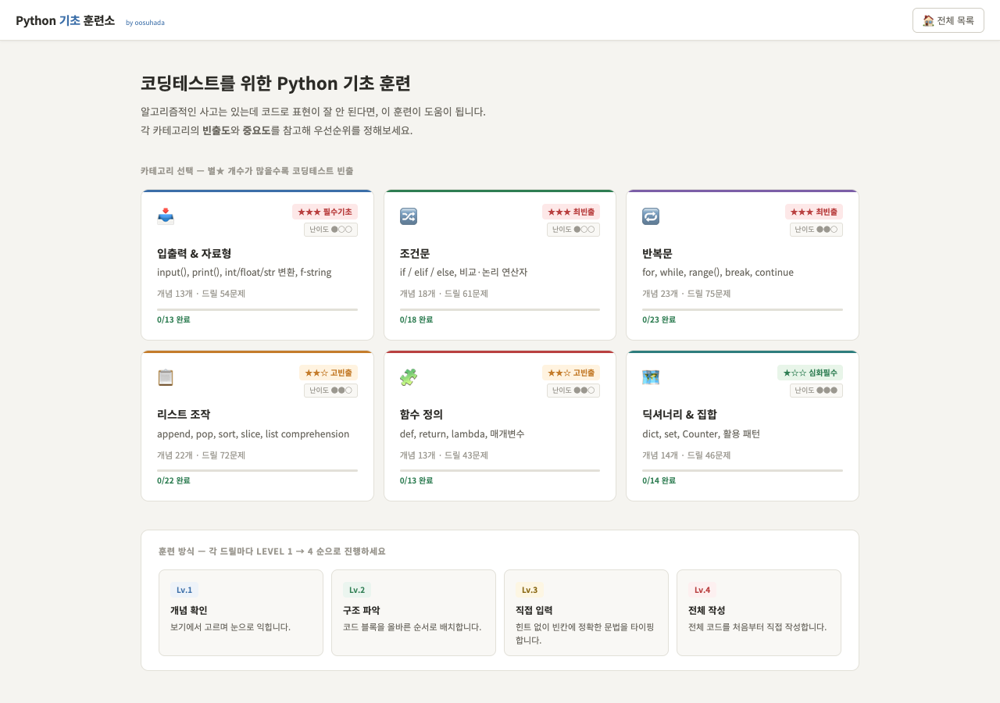

# PyLingo — Python Coding-Test Fundamentals

코딩테스트를 준비하면서 Python 문법과 문제 풀이 패턴을 짧은 drill 단위로 반복하기 위해 만든 정적 학습 도구입니다.

PyLingo is a lightweight browser-based training tool for repeatedly practicing Python syntax and coding-test fundamentals through short, progressive drills.

**Live:** https://oosuhada.github.io/pylingo/

## UI Preview / 구현 화면



위 이미지는 현재 GitHub Pages에 배포된 실제 화면을 headless Chrome으로 캡처한 것입니다.

The screenshot above is captured directly from the currently deployed GitHub Pages application.

## Learning Flow / 학습 방식

- 주제별 카테고리에서 필요한 Python 개념을 선택합니다.
- 각 문제는 작은 실습 단위로 나뉘며 **Level 1 → 4** 순서로 반복합니다.
- 완료한 drill과 진행 상태를 브라우저 `localStorage`에 저장합니다.
- 별도 로그인이나 backend 없이 바로 학습할 수 있습니다.
- 전체 학습 기록을 초기화하고 다시 반복할 수 있습니다.

## What This Shows / 이 프로젝트에서 보여주는 것

- Vanilla HTML/CSS/JavaScript만으로 만든 학습 UX
- category → question → drill로 이어지는 단계형 정보 구조
- 브라우저 상태 저장을 활용한 개인 학습 진행도 관리
- 코딩테스트 학습 내용을 직접 제품 형태의 훈련 도구로 바꿔본 초기 실험

## Structure / 구조

```text
pylingo/
├── index.html                 # application shell
├── python-app-core.js         # navigation, progress, category flow
├── python-app-practice.js     # drill/practice interactions
├── python-data2.js            # learning content
└── python-styles.css          # interface styling
```

## Run Locally / 로컬 실행

정적 사이트이므로 별도 package 설치가 필요하지 않습니다.

```bash
python3 -m http.server 8080
```

Then open `http://localhost:8080`.

## Status / 상태

현재 GitHub Pages에서 동작하는 학습용 프로젝트입니다. 최신 AI/full-stack 대표 프로젝트와는 성격이 다르지만, 반복 학습 문제를 직접 인터페이스로 만든 초기 frontend/product 기록으로 유지합니다.

This is an intentionally small learning product rather than a current flagship project. It is preserved as an early example of turning a personal study workflow into a usable interface.

## Topics

[`coding-test`](https://github.com/topics/coding-test) · [`css`](https://github.com/topics/css) · [`gamified-learning`](https://github.com/topics/gamified-learning) · [`github-pages`](https://github.com/topics/github-pages) · [`html`](https://github.com/topics/html) · [`javascript`](https://github.com/topics/javascript) · [`learning-tool`](https://github.com/topics/learning-tool) · [`python`](https://github.com/topics/python)
